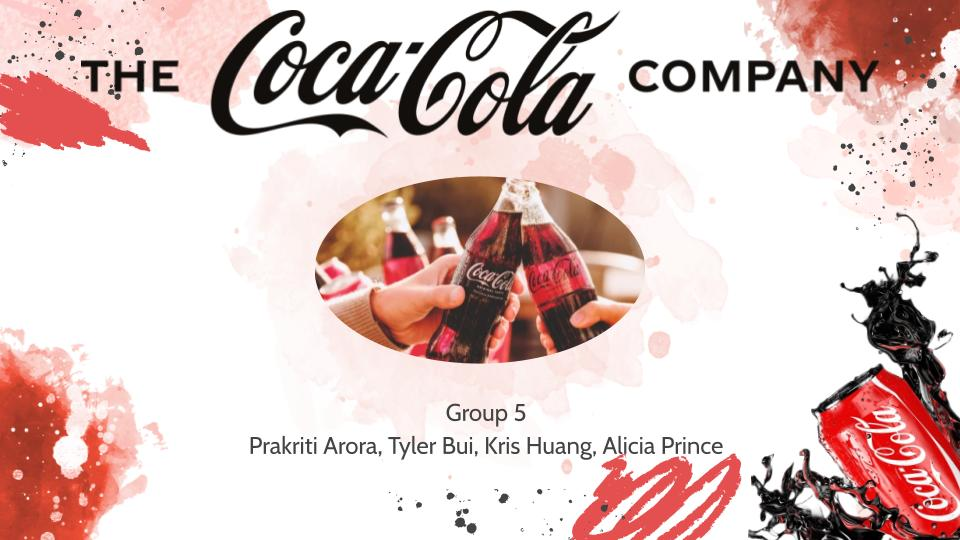
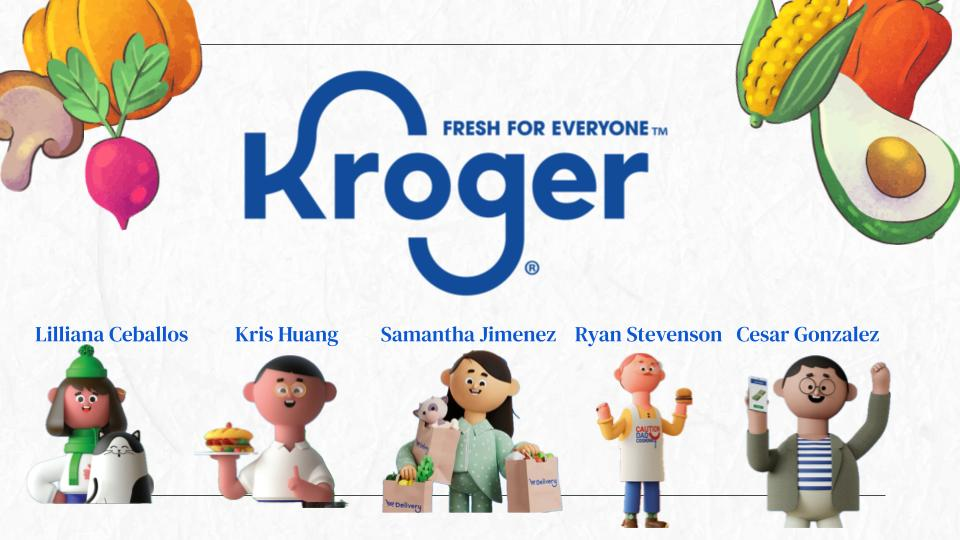
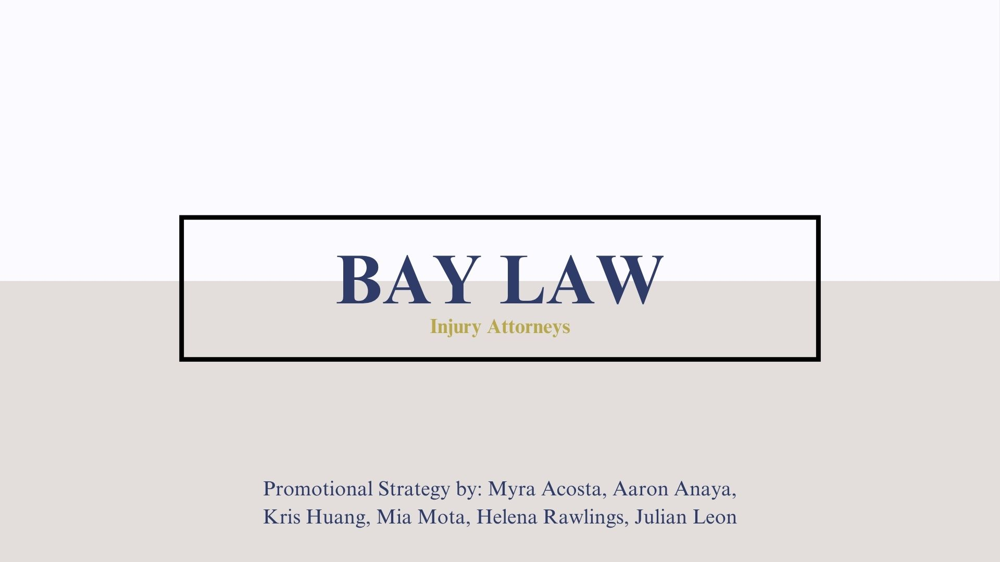
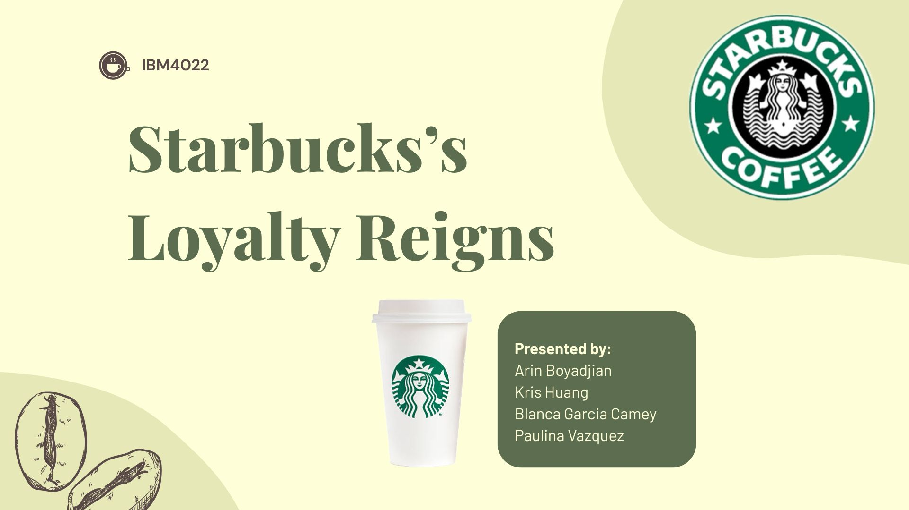

Teamwork is essential when working in Marketing. Over the years, I've done a number of group projects for several Marketing classes at Cal Poly Pomona or projects that relate to Marketing. Here are some of the projects I've worked on alongside my classmates.

------------------------------------------------------------------------

# Accounting in the Coca-Cola Company - ACC 2070

{width="710"}

This project was done for **ACC 2070 - Financial Accounting For Decision Making**.

It focuses on the Accounting aspects of the Coca-Cola Company, such as Accounting Practices, Income Statements, and Balance Sheets. The presentation highlights things like Financial Highlights, Accounting Ethics, and Controversies surrounding its practices.

The full PDF of the presentation can be viewed [here](projects/ACC2070_Group_5_Presentation.pdf).

------------------------------------------------------------------------

# Kroger Company Analysis - MHR 3010

{width="710"}

This project was done for **MHR 3010 - Principles of Management**.

Our group did an analysis on the important aspects of Kroger's management, including Organizing, Leading, and Controlling, as well as a SWOT analysis. The presentation details how Kroger's management aspects affect things such as decision making, communications, strategies, employee benefits, and workplace conditions.

The full PDF of the presentation can be viewed [here](projects/MHR3010_Kroger.pdf).

------------------------------------------------------------------------

# Bay Law Promotional Strategies - IBM 3072

{width="710"}

This project was done for **IBM 3072 - Promotional Strategies**.

As the name of the class implies, the purpose of this project was for us to come up with a promotional strategy for the Bay Law Injury Attorney firm. To do so, we analyzed a variety of factors including their competitors, location and demographic data, media presence, and performing a SWOT analysis. Through them, we came up with a strategy that accounted for target demographics, budget, costs, Return on Investment, and online activity.

The full PDF of the presentation can be viewed [here](projects/IBM3072_Promotional_Strategies_Presentation.pdf).

------------------------------------------------------------------------

# Starbucks Loyalty Program - IBM 4022

{width="711"}

This project was done for **IBM 4022 - Brand Impression and Management**.

Our group was assigned a case on Starbucks' loyalty program and how it shaped the business, its practices shaping its customer-based brand equity, the technology-focused aspects shaping its identity, and its social media presence and mobile app being iconic among its consumer base.

The full PDF of the presentation can be viewed [here](projects/IBM4022_Starbucks.pdf).
